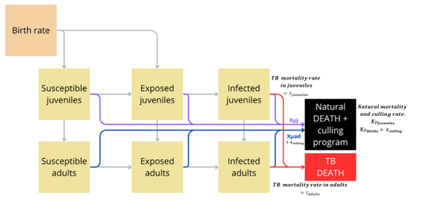

# Mortality rate

## What happens if the mortality rate is dependent on the age groups?



To explore the effects of age-specific mortality on TB dynamics, we adapted the model to allow different natural and disease-induced death rates for juveniles and adults. This modification can reflect biological differences such as increased vulnerability in young possums and resilience in older individuals.

-   Natural mortality in juveniles: $\mu_1$

-   Natural mortality in adults: $\mu_2$

-   TB-specific mortality in juveniles: $\tau_1$

-   TB-specific mortality in adults: $\tau_2$

The sliders below offer a way to simulate realistic demographic vulnerabilities in a possum den and observe how age-specific survival shapes epidemic outcomes.


::: {.cell context='server'}

:::


# Age-Dependent Mortality in Possums


::: {.cell context='server'}

:::

```{ojs}


//| echo: false

viewof tau1 = Inputs.range([0.1, 3], {step: 0.3, label: "TB Mortality (Juveniles)"})
viewof tau2 = Inputs.range([0.1, 3], {step: 0.3, label: "TB Mortality (Adults)"})
viewof mu1 = Inputs.range([0.1, 1], {step: 0.1, label: "Natural Mortality (Juveniles)"})
viewof mu2 = Inputs.range([0.1, 1], {step: 0.1, label: "Natural Mortality(Adults)"})

filteredMortality = mortality_data.filter(d =>
  d.tau1 === tau1 &&
  d.tau2 === tau2 &&
  d.mu1 === mu1 &&
  d.mu2 === mu2 )


mortality_long = filteredMortality.flatMap(d => [
  { time: d.time, Deaths: d.natural_deaths_juveniles, Type: "Natural mortality in juveniles" },
  { time: d.time, Deaths: d.natural_deaths_adults, Type: "Natural mortality in adults" },
    { time: d.time, Deaths: d.natural_deaths_total, Type: "Total natural mortality" },
  { time: d.time, Deaths: d.tb_deaths_juveniles, Type: "TB Juveniles" },
  { time: d.time, Deaths: d.tb_deaths_adults, Type: "TB Adults" },
  { time: d.time, Deaths: d.tb_deaths_total, Type: "Total TB Mortality" }
])


compartment_mortality = filteredMortality.flatMap(d => [
  { time: d.time, Count: d.SJ, Compartment: "Susceptible Juveniles" },
  { time: d.time, Count: d.EJ, Compartment: "Exposed Juveniles" },
  { time: d.time, Count: d.IJ, Compartment: "Infectious Juveniles" },
  { time: d.time, Count: d.SAd, Compartment: "Susceptible Adults" },
  { time: d.time, Count: d.EAd, Compartment: "Exposed Adults" },
  { time: d.time, Count: d.IAd, Compartment: "Infectious Adults" }
])

```

```{ojs}


//| echo: false

html`<div style="display: flex; gap: 2rem;">
  <div style="width: 250px;">
    <p><strong>Mortality rates</strong></p>
    ${viewof tau1}
    ${viewof tau2}
    ${viewof mu1}
    ${viewof mu2}
    <p style="font-size: 0.9em;">
<strong>Key patterns:</strong><br>
<strong>Higher juvenile TB mortality</strong> tends to reduce the number of infectious juveniles. In extreme cases, this can nearly eliminate infection in juveniles due to early death before transmission.<br>

<strong>Increasing juvenile natural mortality </strong> reduces the total number of young possums—especially susceptible ones—and shifting the population structure toward adults.<br>

<strong>Adult TB mortality</strong> strongly influences the total number of infectious adults. High values lead to rapid declines in infected adults, which can reduce overall TB burden but may also decrease population size if too many breeding adults die.<br>

<strong>Adult natural mortality</strong> moderates long-term population dynamics. Higher rates lower the number of adults, and if combined with low juvenile survival, can lead to population decline.<br>

<strong>Total TB mortality</strong> tends to be more sensitive to changes in adult parameters due to the larger initial adult population.
    
    </p>
  </div>

  <div>
    <h3>Age-dependent mortality</h3>

    <p><em>TB Infection Model</em></p>
  
    ${Plot.plot({
    marks: [
    Plot.lineY(compartment_mortality, {
    x: "time",
    y: "Count",
    stroke: "Compartment"
  }),
  ],
  color: {
    domain: [
      "Susceptible Juveniles",
      "Exposed Juveniles",
      "Infectious Juveniles",
      "Susceptible Adults",
      "Exposed Adults",
      "Infectious Adults"
    ],
    range: ["blue", "orange", "red", "green", "purple", "brown"],
    type: "ordinal",
    legend: true, 
    label: "Compartment"
  },
  x: { label: "Time (Years)" },
  y: { label: "Number of Possums" },
  width: 700,
  height: 350,
  marginLeft: 50,
  marginBottom: 40
})}
 
  
  
  <p><em>Total population over time</em></p>

    ${Plot.lineY(filteredMortality, {
      x: "time",
      y: (d) => d.SJ + d.EJ + d.IJ + d.SAd + d.EAd + d.IAd,
      stroke: "steelblue"
    }).plot({
      y: {label: "Total Population"},
      x: {label: "Time (Years)"},
      marginLeft: 50,
      marginBottom: 40,
      width: 600,
      height: 300
    })}
 
    

    <p><em>Mortality Over Time</em></p>
    ${Plot.plot({
      marks: [Plot.lineY(mortality_long, {
        x: "time",
        y: "Deaths",
        stroke: "Type"
      })],
      
      color: {
  domain: [
    "Natural mortality in juveniles",
    "Natural mortality in adults",
    "Total natural mortality",
    "TB Juveniles",
    "TB Adults",
    "Total TB Mortality"
  ],
  range: ["green", "red", "orange", "black"],
  type: "ordinal",
  label: "Mortality Type",
  legend: true
      },
      x: {label: "Time (Years)"},
      y: {label: "Deaths per Unit Time"},
      width: 700,
      height: 350
    })}
  </div>
</div>`

```

